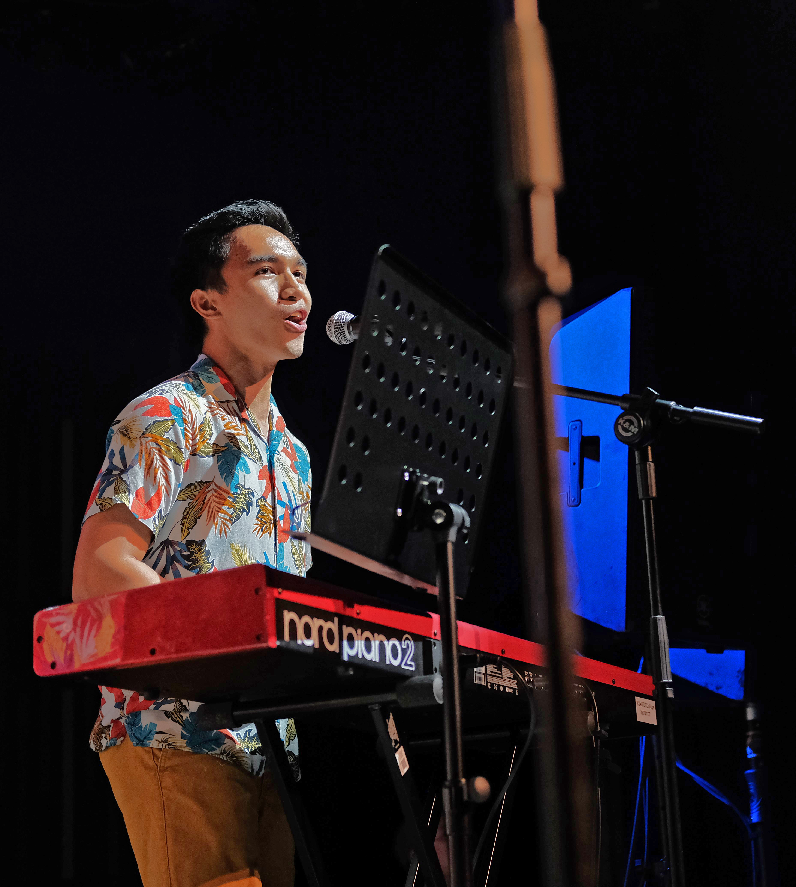

  

Hey! Welcome to my website. I am broadly interested in making the benefits of Artificial Intelligence (AI) accessible to the most number of people while preventing it from further harming marginalized groups. My overarching project is to use and develop AI technology and governance for positive social and environmental change. Curious? Check out my [Values](/values/values) page. Since benefits are not fully enjoyed and applied when it is not understood, I make it a crucial priority to communicate my work to people from different backgrounds through [Medium](https://medium.com/@ajsanjoaquin).

In my free time, I am a Senior undergrad at Yale-NUS working on the intersection of Safety and Ethics of AI.
I am working on these issues specifically for Deep Learning models @ Data Privacy and Trustworthy Machine Learning Research Lab, NUS led by Prof. Reza Shokri.

UPDATE: I just finished my bachelor's thesis with fortunate guidance from Prof. Shokri and Prof. Michael Choi of Yale-NUS. A derivative of my work, in collaboration with Google Brain, can be found [here](https://arxiv.org/abs/2204.00032). I wrote an [article](https://medium.com/geekculture/in-poison-there-is-truth-63029bbc4e41) about it, but you can also check out its [feature](https://www.theregister.com/2022/04/12/machine_learning_poisoning) by *The Register*.)  

You can find my CV [here](https://ajsanjoaquin.github.io/lol/San%20Joaquin%2C%20Resume.pdf). 

I also do a lot of (seemingly) random activties throughout my collegiate career.
I enjoy the outdoors: doing either cycling, hiking, or walking 6 feet *above* the ground. As of 09/2021, I have completed cycling around Singapore, doing an imperial century in the process (162 km!). As of 08/2022, I have gone around the Danish archipelago via bikepacking (≈500 km)! Our documentary film will be released soon. 

I also enjoy performing music on either the keyboard, vocals, or both. You can find concerts involving my bands Arkipelago (2019) [here](https://youtu.be/IDWpC1mmqNs?t=2975) and Sketchy White Van (2022) [here](https://youtu.be/qGI2ng3u13o?t=1437).

I'm also a yOuTubEr, making scripts (and doing data science?!) for [808CJK](https://www.youtube.com/c/808CJK).
